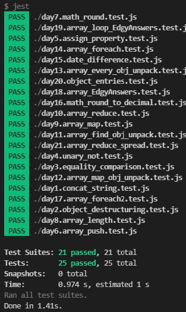

# Explanation

[Lighthouse Labs 21 Days Coding Challenge (JavaScript Basics)](!https://coding-challenge.lighthouselabs.ca/challenges) with runnable assertions on Windows:

After ensuring envrionment is setup via [How-To](#how-to), run `yarn test` or `npm test` to see all tests pass.

# How-To

[Set up WSL2 on Windows](!https://docs.microsoft.com/en-us/windows/dev-environment/javascript/nodejs-on-wsl) for Linux environment

[Set up NodeJS on WSL2](!https://docs.microsoft.com/en-us/windows/dev-environment/javascript/nodejs-on-wsl) for executing JavaScript

[Set up Yarn](!https://dev.to/bonstine/installing-yarn-on-wsl-38p2) for installing packages

[Set up Jest](!https://jestjs.io/docs/getting-started#:~:text=Jest%20using%20yarn%3A-,yarn%20add%20%2D%2Ddev%20jest,-Copy) for testing code, run `yarn install` *in* the directory of `/misc/lighthouse_21day/` where package.json is located.
